# Location Feature - Architecture Diagrams

## 1. Feature Layer Structure

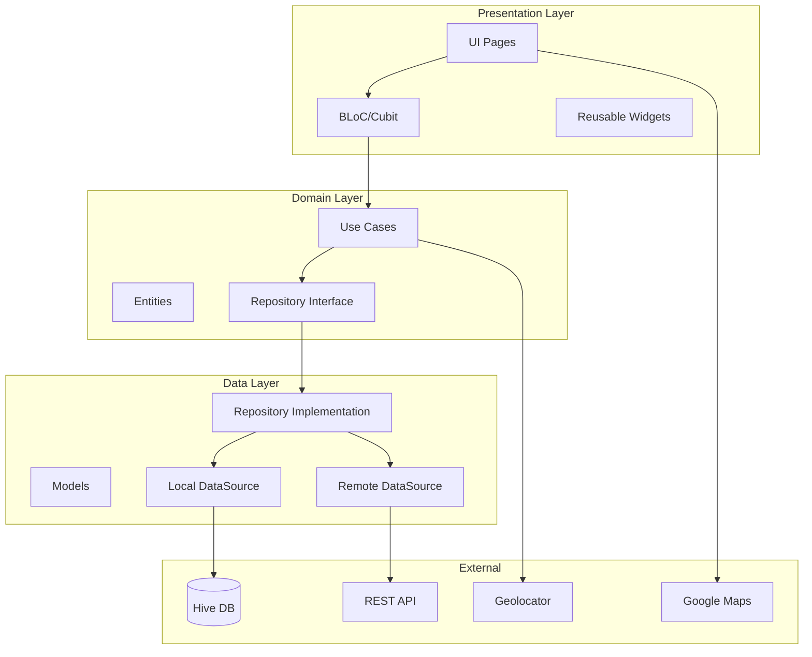

## 2. Add Address Flow

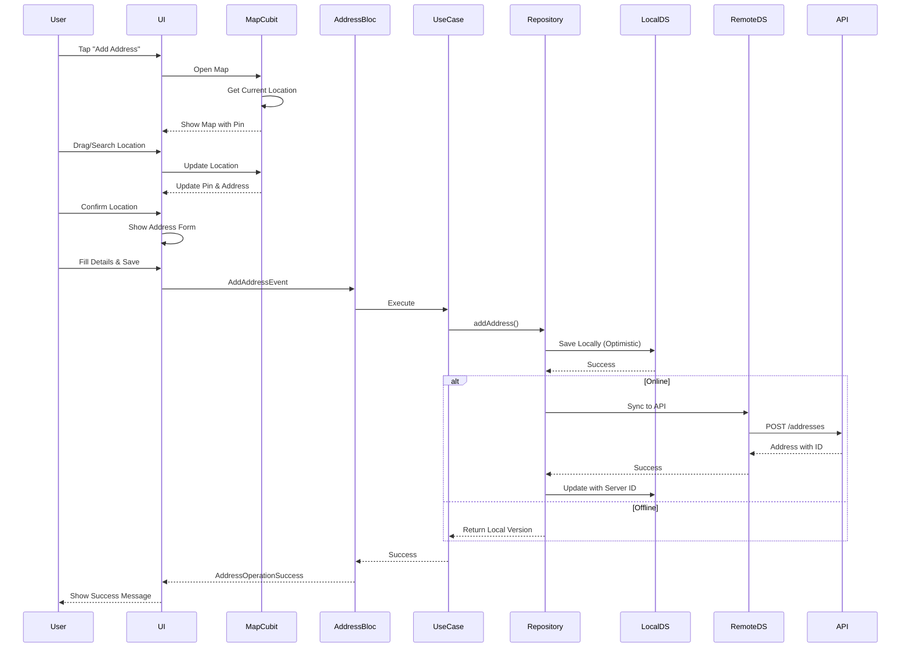

## 3. Load Addresses Flow

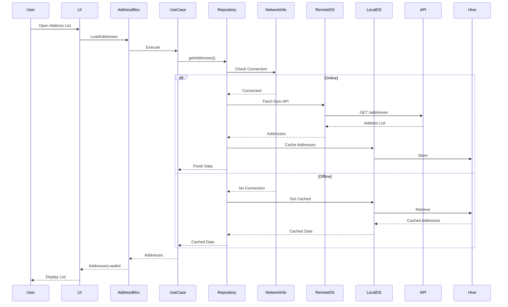

## 4. Map Interaction Flow

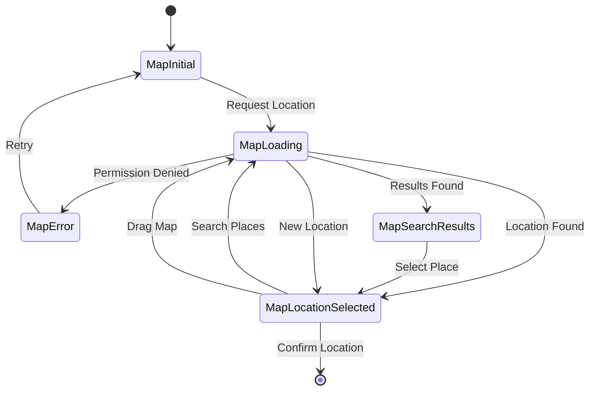

## 5. Data Sync Strategy

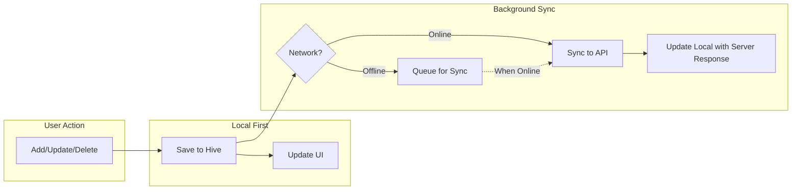

## 6. BLoC State Management

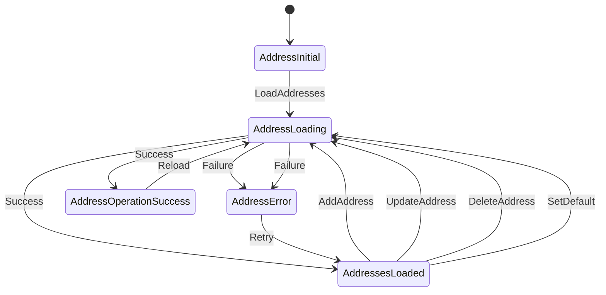

## 7. Component Dependencies

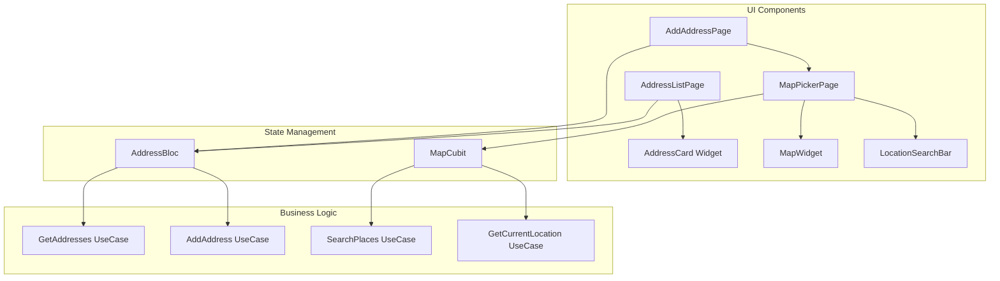

## 8. Error Handling Flow

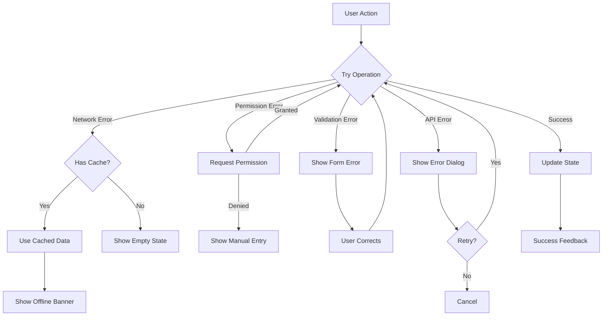

## 9. Database Schema

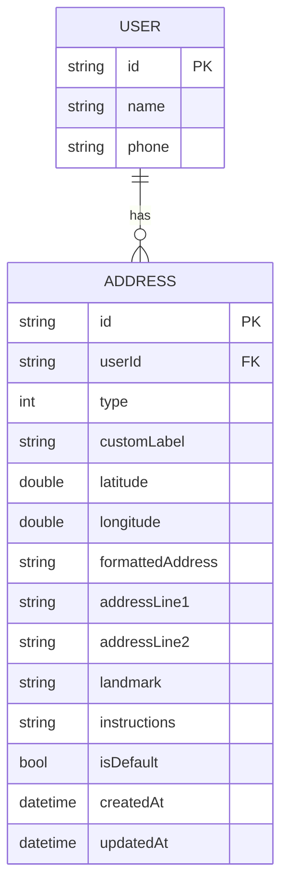

## 10. API Integration

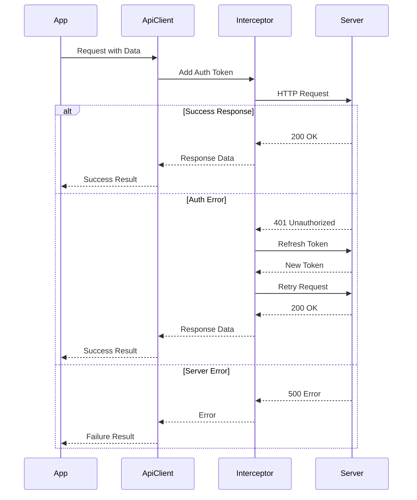

## 11. Permission Flow

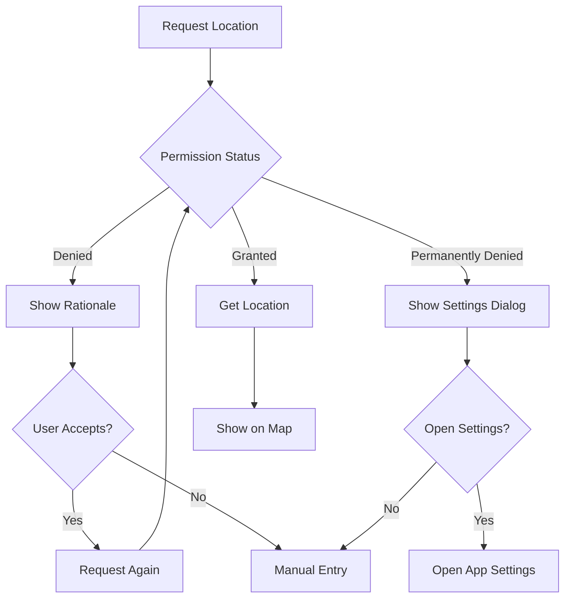

## 12. Offline Sync Queue

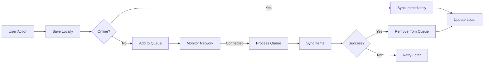

---

## Key Design Decisions

### 1. Offline-First Architecture
- **Why**: Ensures app works without internet
- **How**: Save to local DB first, sync in background
- **Benefit**: Better UX, faster response times

### 2. BLoC Pattern
- **Why**: Separates business logic from UI
- **How**: Events trigger use cases, states update UI
- **Benefit**: Testable, maintainable, reactive

### 3. Clean Architecture
- **Why**: Separation of concerns, testability
- **How**: Domain → Data → Presentation layers
- **Benefit**: Easy to modify, scale, and test

### 4. Hive for Local Storage
- **Why**: Fast, lightweight, type-safe
- **How**: Store addresses with adapters
- **Benefit**: Better than SQLite for this use case

### 5. Repository Pattern
- **Why**: Abstract data sources
- **How**: Single interface, multiple implementations
- **Benefit**: Easy to swap data sources, mock for testing

---

## Performance Optimizations

1. **Lazy Loading**: Load map only when needed
2. **Debouncing**: Search queries debounced by 300ms
3. **Caching**: Cache map tiles and geocoding results
4. **Pagination**: Load addresses in batches if many
5. **Optimistic Updates**: Update UI before API response
6. **Background Sync**: Sync in background when online

---

## Security Measures

1. **API Key Protection**: Store in environment variables
2. **Token Management**: Refresh tokens automatically
3. **Input Validation**: Validate all user inputs
4. **Encrypted Storage**: Encrypt sensitive data in Hive
5. **Permission Handling**: Request minimal permissions
6. **Rate Limiting**: Prevent API abuse

---

These diagrams provide a comprehensive visual guide to understanding the location feature architecture and its implementation details.